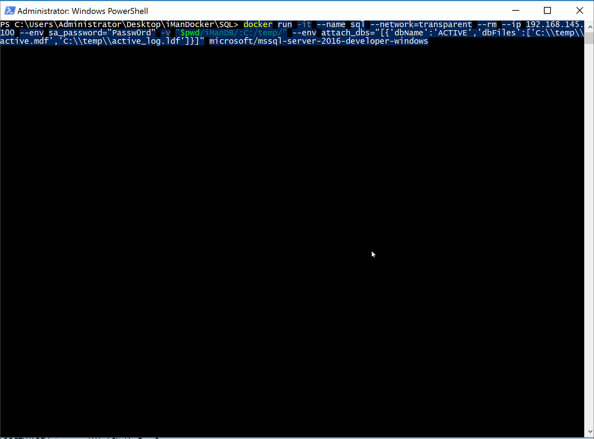
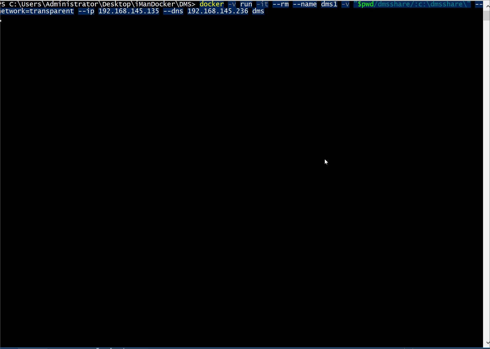
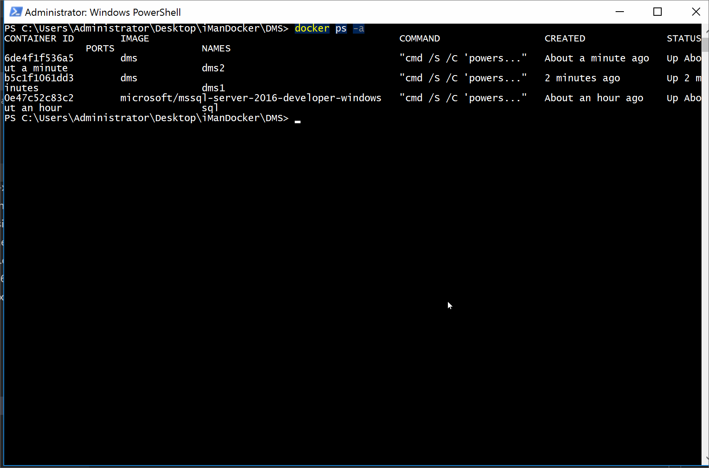
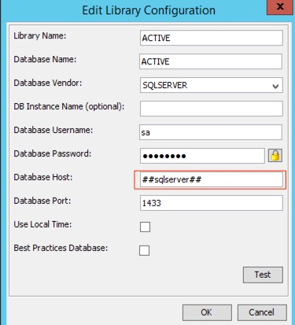
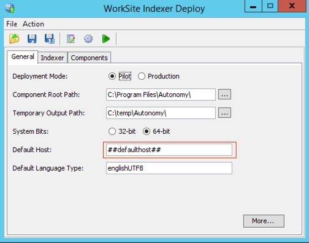
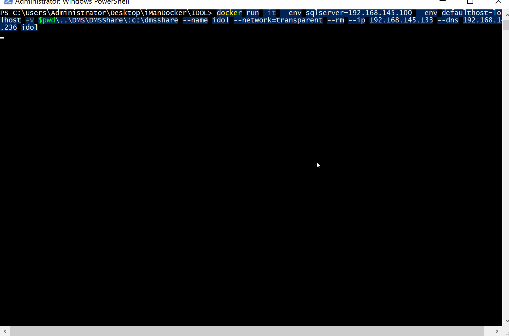

How to run iManage Work on Windows Containers
===========

***WARNING: DO NOT RUN IN A PRODUCTION ENVIRONMENT - THIS IS FOR DEV/DEMO ENVIRONMENTS ONLY***

Here are some example instructions on how to create a dev/test environment for iManage Work (currently at ver 9.4) running under the new Containers feature of Windows Server 2016.

With these files and scripts I've been able to "containerize" the SQL Server, the Work Server and the Indexer (IDOL) Server, albeit with a few limitations.

I have intentionally left out any iManage Work binaries, configuration files, and serial numbers, but if you are an iManage partner or customer I'm sure you know where to get them...

I also expect you to have a Windows Server 2016/Windows 10 VM or physical server/laptop running with the container feature installed and the docker binaries already working.
If you need to know how to do that you should read [this](https://msdn.microsoft.com/en-us/virtualization/windowscontainers/quick_start/quick_start) first.

Each folder in this repository contains the scripts and dockerfiles needed to get started.

For the networking I'm using [transparent mode](https://msdn.microsoft.com/en-us/virtualization/windowscontainers/management/container_networking#transparent-network) so that I can talk directly to ther VMs that I am running in the same network.

**GOTCHAS:**

* the Docker build process on Windows does not like paths with spaces in them, so I had to rename some of the iManage install MSIs in order to get around this issue.

* since the containers are non-persistent the metadata is saved on the MSSQL database and the Work library files on a folder on the container host _BUT THEY ARE SEEN BY THE CONTAINERS AS BEING LOCAL (C:\DMSSHARE)_. Since the DB Admin tool won't let you do that (it only accepts smb paths) you will need to change the path later with SQL Server Manager.

* the IDOL is non-persistent and re-crawls the library every time it starts.

* containers have no GUI, so all of the iManage Work configuration is ~~hacked together~~ handled with  Powershell scripts and registry keys imports.

* the configuration tools (iManage Service Manager) do not work remotely (probably because the container is not a full windows VM thus is not reachable via RPC). In order to build the images you will need to gather some files and registry keys from an already existing iManage Work environment. 
What I've done is install the DMS and Indexer on a VM, configured what I needed using the iManage GUI tools (iManage Service Manager, DB Admin, SQL Manager, IDOL Deploy tool, etc) then export what I needed accordingly. 
To ease the pain I've configured the Work Server container to import a registry file at runtime.

* **all commands are run in Powershell**

Enough talk, let's get started!

---

SQL Server:
-----------
Running a Microsoft SQL Server container is pretty easy since there is an image already built for us by the folks at Microsoft! You just need to drop the database files, pass a few parameters and it will start up right away. No need for the usual 30 minutes install.

* This container uses the microsoft/mssql-server-2016-express-windows image provided by Microsoft. if you have not already done so please download it by running
    
        docker pull microsoft/mssql-server-2016-express-windows

* create a new iManage DB (called ACTIVE) on another host via the database administrator and copy the ACTIVE.mdf and ACTIVE_log.mdf files in the iManDB folder.

* since I'm not using a file share (windows server containers for some reason don't allow that role), once the DB is created modify the MHGROUP.DOCSERVERS table (there should be only one entry) by changing the location from \\whatever\share to c:\DMSSHARE. Trust me, it will work...

* start the container with

         docker run -it --name sql --network=transparent --rm --ip 192.168.145.100 --env sa_password="Passw0rd" -v "$pwd/iManDB/:C:/temp/" --env attach_dbs="[{'dbName':'ACTIVE','dbFiles':['C:\\temp\\active.mdf','C:\\temp\\active_log.ldf']}]" microsoft/mssql-server-2016-express-windows

at this point you will see the sql server start up, with the SA password that we specified and the ACTIVE database already attached!

*in the .gif it says "microsoft/mssql-server-2016-developer-windows". I originally used this image but it's not available anymore.*

---

Work Server \**with clustering*\*
-----------

1. Let's start by pulling the Windows Server 2016 Core image:

            docker pull microsoft/windowsservercore

2. In order to build the Work Server image you will need to create (in the same directory where the dockerfiles are) a folder "INSTALL"  with all of the prerequisites, after that docker will do the rest.
Under a normal environment these prerequisites would be installed by the Work Server run_setup.exe, but unfortunately it fails on Server Core (there is an issue with the Java install that expects a GUI that is not there...).
the prerequisites are:
    * vc2008sp1redist_x64.exe
    * vc2008sp1redist_x86.exe
    * NDP451-KB2858728-x86-x64-AllOS-ENU.exe
    * python-2.7.9.amd64.msi
    * vc_2005_sp1_redist_x64.exe 
    * vc_2013_redist_x64.exe
    * Redis-x64-3.0.500.msi
    * jre-8u101-windows-x64.exe

    you will also need to place fhe following in the install folder:

    * c:\windows\system32\mapi32.dll (it's missing from Windows Server Core but it's needed by Work Server)
    * the iManage Work MSI (to be renamed to imanage.msi) and it's Data1.cab files
    * the Clustering Service MSI (to be renamed to clustering.msi)
    * your serial numbers (to be passed as arguments during the build process)
    * a pair of private and public rsa keys (i did a GUI install with the same server name to generate them)
    
    Last but not least you will need:
    * a registry key export of *HKEY_LOCAL_MACHINE\SOFTWARE\Interwoven\WorkSite* from a server configured with the same ip addresses, passwords, databases as the one you would like to run inside the container.

    Since this is a demo environment I am saving the library data in the C:\ drive of the container by using the 

            VOLUME c:\\DMSShare

    directive in the Dockerfile, then mapping it to a folder of the container host during runtime (it will also be used later by the IDOL server).

3. Create a folder called DMSShare at the same level of the INSTALL folder and place the registry key export *(it expects a file called imanage.reg)* inside it. This will be needed at runtime to configure the DMS.

4. edit the adddsn.ps1 script and modify the IP address of your SQL Server

5. Since Work Server has so many prerequisites I split the container in 2 images, one that has all of the prerequisites and another one that has just the Work Server install. Since the second one depends on the first one we're not actually wasting any space.

    To get started with building the base image run the following commands:

            docker build -t dmsbase . -f Dockerfile_DMSBASE

   this is going to take a while, so go take a walk or go bother one of your colleagues near your cubicle!
   the beauty of this container approach is that if you need to change any of the build steps, you don't need to start from scratch. Docker knows the layering order and starts from the closest one to where you made the change.
    
    When that is completed you can build the second image by passing all of the necessary arguments (replace with your own serial numbers):

            docker build -t dms . -f Dockerfile_DMS --build-arg PIDKEY='SERVERSERIAL' --build-arg MOBILITY_PIDKEY='MOBILITYSERIAL' --build-arg SDK_LICENSE_PIDKEY='SDKSERIAL' --build-arg APACHE_SERVER_NAME='dms.test.lab' --build-arg CLUSTERING_PIDKEY='CLUSTERINGSERIAL' --build-arg SSLCERT='c:\INSTALL\work-cert.crt' --build-arg SSLKEY='c:\INSTALL\work-key.key'

6. once the image is built (hopefully you didn't get any errors) you can run it via the following command:

            docker -v run -it --rm --name dms1 -v "$pwd/dmsshare/:c:\dmsshare\" --network=transparent --ip 192.168.145.135 --dns 192.168.145.236 dms

    when the image runs it executs the start-dms.ps1 script which imports the self-signed cert, does an invoke-webrequest for the web interface (I don't know why but the Work Server won't start until it gets a reqeust on its interface...might be a bug) and then displays the logfiles on the console.

    if you are successfully you should see something like this:

  

    **the cool thing is that if you want to run another instance of the DMS (and have it join the cluster) you can just re-run the same command with another ip address and container instance name and it will automatically join! (as long as it's in the DNS of course...)**

            docker -v run -it --rm --name dms2 -v "$pwd/dmsshare/:c:\dmsshare\" --network=transparent --ip 192.168.145.136 --dns 192.168.145.236 dms 

    result: (you can see in the fma logs that the node is leaving after i stop the imdmssvc service)

    

    the cluster works because even though we're saving the library files to the C:\ drive it's actually mapped to a folder on the host, thus making it look like a windows share that both cluster nodes can see.

---

Indexer Server
-----------

The indexer server is a little bit more complicated since it requires an actual deploy zip, but as you will see it's actually pretty flexible since all of the configuration can be managed by some Powershell magic!

to start you will need to create another INSTALL directory and place the following files in it:

* jre-8u101-windows-i586.exe
* vcredist_2005_x64.exe
* vcredist_2005_x86.exe
* vcredist_2010_x64.exe
* vcredist_2010_x86.exe

after that you will need to run a Worksite Indexer Deploy and configure the defaulthost and worksite library sql server with some special names that will replace once the container is up. Obviously I could have done much more parametrization but since this is just a proof of concept for me it's enough...

This is an out-of-the-box deploy which means that I haven't enabled the Workspace or Metadata indexing.

once that's done you can unzip the file generated, rename it as "deploy" and copy/move it into the INSTALL directory.

**Let's build!**

1. Since the indexer server is based on the same Windows Server Core image as the Work Server so we won't need to do a "docker pull"...beats the heck out of installing a new Windows VM, doesn't it?

2. if everything is in place just run the build command

            docker build -t idol .

   this will take a while so go grab a coffee, if you made it this far your earned it!

   (this image is sped up 10x!)
   

3. once the build is done you can run the Indexer Server

        docker run -it --env sqlserver=192.168.145.100 --env defaulthost=localhost -v $pwd\..\DMS\DMSShare\:c:\dmsshare --name idol --network=transparent --rm --ip 192.168.145.133 --dns 192.168.145.236 idol

this is what it will look like:

 

you have probably noticed during the crawl that it's getting the files from "c:\dmsshare" which is what I've set up in the database as the location.
Again, this works because I've mapped the folder where the data is located ON THE HOST to a folder ON THE CONTAINER.

---

**What's Missing**

*Communication server:*

I don't think this can be done in a container since it requires the SMTP server, which (for reasons unknown to me) cannot be added to a window server container image.

*Preview Server:*

I cannot get the installer to run in silent/unattend mode and I haven't had time to analyze the install to se if it can be replicated by copying the files by hand.

*OCR Module:*

This just came out but by looking at the instructions it shouldn't be too hard to get working.

*WRAP UP*

Hopefully you were able to get everything running...if you have any questions please feel free to write me an email at giordy_at_giordy.it, I'll try to help as best as I can.

*Next Up*

get it running on a docker swarm!!

